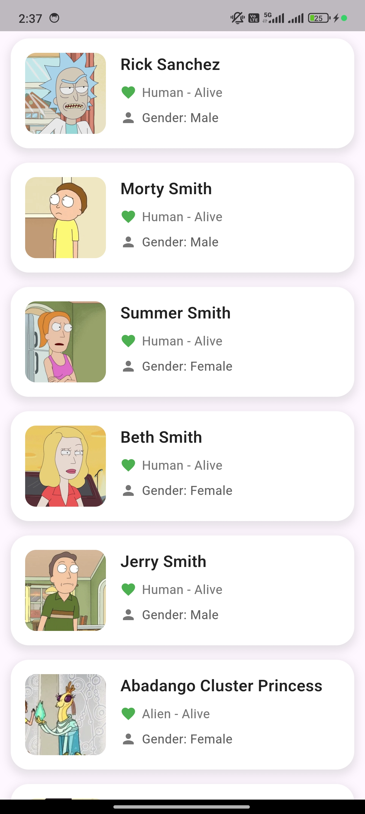
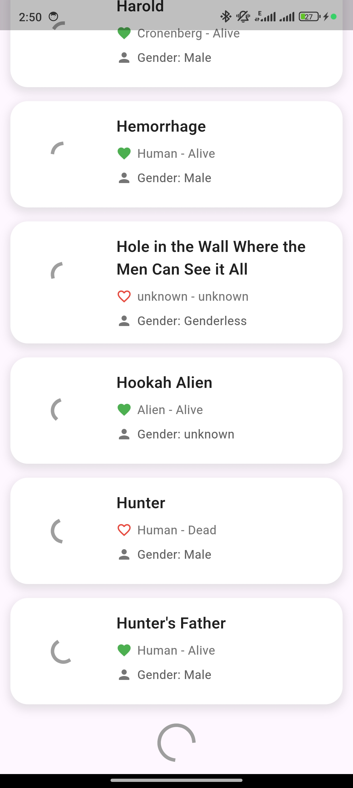
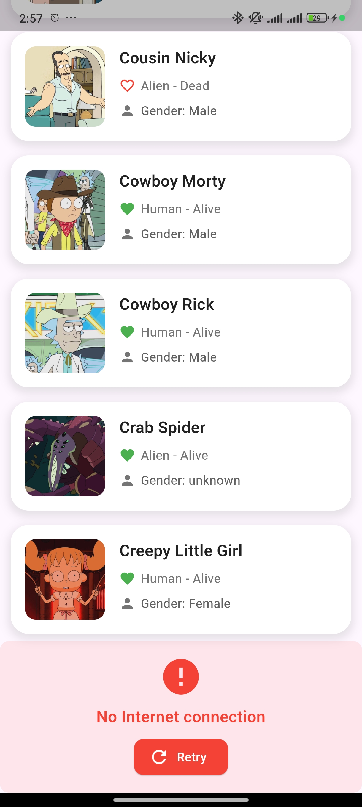

## Rick & Morty - Flutter BLoC Clean Architecture Project

<h4 align="left">
  Rick & Morty: A BLoC-Driven Flutter App with Clean Architecture
</h4>

### Stack

| Tools               | Link                                                            |
|:--------------------|:----------------------------------------------------------------|
| State Management | [flutter_bloc](https://pub.dev/packages/flutter_bloc)           |
| Service Locator  | [get_it](https://pub.dev/packages/get_it)                       |
| Serialization    | [json_serializable](https://pub.dev/packages/json_serializable) |
| Network Requests    | [http](https://pub.dev/packages/http) |
| Image Caching    | [cached_network_image](https://pub.dev/packages/cached_network_image) |
| Equality Comparison   | [equatable](https://pub.dev/packages/equatable) |

### Showcases

<table style="width:100%">
  <tr>
    <th>Characters Success</th>
    <th>Characters Next Page Loading</th> 
    <th>Characters Next Page Failure</th>
    <th>Characters Failure</th>
  </tr>
  <tr>
    <td></td> 
    <td></td>
    <td></td>
    <td></td>
  </tr>
</table>